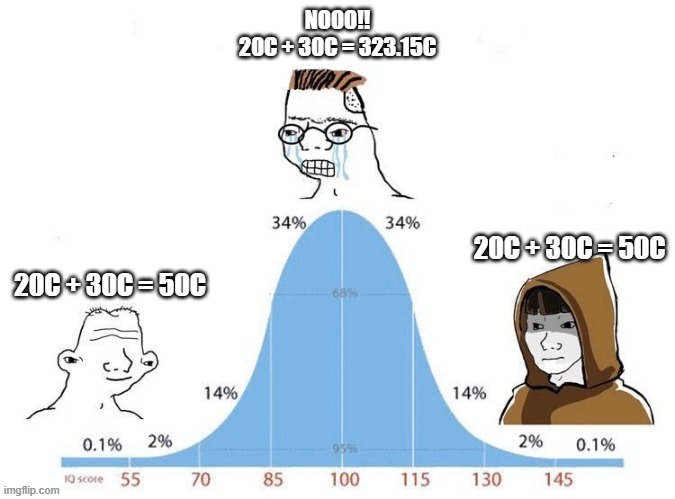

# Temperature

Temperatures are wierd. The units celsius and fahrenheit are relative units, meaning that 20 [C] is equal to 20 [K] above the temperature 273.15 [K]. This has some impact on addition using temperature units.

pyees implements the following rules with respect to tempatures

 - No conversion is done if two temperatures with the same units are added or subtracted.
 - A tempaturedifference is returned, when subtracing two units
 - If temperature difference is added to or subtracted from a temperature, then a tempeature is returned in the same unit as the original temperature 
 - A temperature cannot be subtracted from a tempertaure difference


```
20 [C] + 30 [C] = 50 [C]
30 [C] + 10 [K] = 273.15 [K] + 30 [K] + 10 [K] = 313.15 [K]


30 [C] - 20 [C] = 10 [DELTAC]
30 [C] - 20 [K] = 273.15 [K] + 30 [K] - 20 [K] = 293.15 [K]
```


## Addition Levels



### Level 1

In addition level 1, the units are used as any other units. When the units match, we can add the units.

```
20 [C] + 30 [C] = 50 [C]
```
### Level 2

It has come to mind that addition following level 1 does not make any sense. Tak the following example

```
0 [C] + 0 [C] = 0 [C]

0 [C] + 0 [C] = 0 [K] + 273.15 [K] + 0 [K] + 273.15[K] = 546.3 [K] = 273.15 [C]
```

The above example clearly shows, that addition using relative units leads to ambiguity. Therefore, the variables has to be converted in to the SI unit system before any addition can be done. This is the only logical way to do things


### Level 3

It has come to mind that the mean value of 2 temperatures cannot be determined using addition level 2.

```
t1 = 20 [C]
t2 = 30 [C]
t_avg = (20 [C] + 30 [C]) / 2 = (20 [K] + 273.15 [K] + 30 [K] + 273.15[K]) / 2 = 596.3 [K] / 2 = 298.15 [K] = 25 [C]
```

One fix to this problem is to introduce temperature differential units, which are indentical to the temperature units, but are not relative - the do not have an offset from zero.

```
t1 = 20 [C]
t2 = 30 [C]
dt = t2 - t1 = 10 [DELTA C]
t_avg = t1 + dt / 2 = 20[C] + 10 [DELTA C] / 2 = 20 [K] + 273.15 [K] + 10 [K] / 2 = 298.15 [K] = 25 [C]
```

Now, this works. But what if you want to determine the mean of 100 temperatures. Then you would have to define 100 temperature differences before adding it all up.

Also, there exists no problem in physics, where you would have to add two temperature, and expect the output from addition level 2. 

The only logical thing to do is to simply look at the units, if they match the variables can be added together as normally. Exactly the same as in addition level 1

```
20 [C] + 30 [C] = 50 [C]
```

